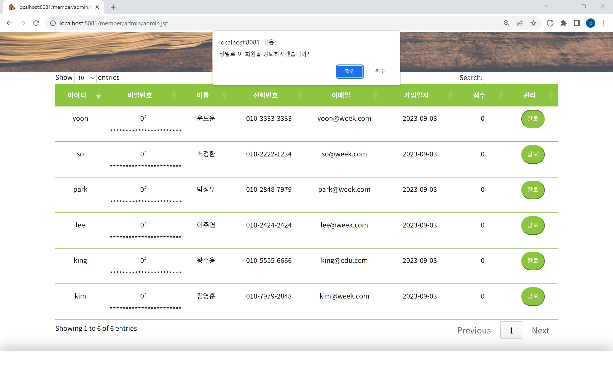

# Project 1 : kiwe

## 📝 프로젝트 개요
커뮤니티 게시판의 기능들을 구현한 웹 애플리케이션으로, 'kiwe(키위)'라는 가상의 교육 기업을 주제로 개발하였습니다. 

## 💻 기술 스택
        

## 🔧 기능 구현
### Member
#### 회원가입
- 회원 약관에 동의 시 회원가입 가능
- 아이디 중복 체크 완료 후에 가입 가능
- 비밀번호와 비밀번호 확인의 값이 일치해야 최종 회원가입 성공
- 비밀번호는 SHA-256 방식으로 암호화

#### 로그인
- DB에서 비밀번호를 불러와 비교 후 로그인 성공 또는 실패
- 일반 회원과 달리 'admin' 관리자 계정으로 로그인 시에는 '관리자페이지' 접속 가능

#### 마이페이지
- 회원 정보 확인
- 정보 수정 시 "전화번호"와 "이메일"만 수정 가능
- 비밀번호는 보안 상 변경 불가
- 자진 회원탈퇴 기능 구현

### Company
#### 회사소개
- 정적 콘텐츠로 kiwe에 대한 소개 페이지
- 'kiwe란' 페이지 내에서 마우스 스크롤 또는 상단 버튼 클릭을 통해 kiwe story로 이동 가능

### 고객센터
#### 공지사항
- Board 테이블에서 공지사항 리스트를 불러와 출력
- 로그인을 하지 않아도 공지사항을 열람할 수 있음
- 관리자 계정으로 로그인 시에 공지사항 글 작성, 수정, 삭제가 가능함
- 글 수정 또는 삭제 후 공지사항 글목록으로 redirection

#### 자주하는 질문
- Faq 테이블에서 자주 하는 질문 리스트를 불러와 출력
- 로그인을 하지 않아도 자주하는 질문을 열람할 수 있음
- 

#### 1:1 문의
- Qna 테이블에서 리스트를 불러와 출력
- 로그인을 하지 않아도 모든 글/댓글의 열람은 가능하나 글/댓글 작성은 불가능함
- 모든 회원은 1:1문의 게시판에서 글/댓글 작성이 가능함
- 글ㆍ댓글 수정/삭제는 그 글ㆍ댓글의 작성자 또는 관리자만 가능함
- 로그인을 하지 않고 댓글창을 클릭한 경우 자동으로 로그인 화면으로 이동함

### 인재채용
#### 지원하기
- 이력서 지원폼으로 지원하기 버튼 클릭 시 crew 테이블에 INSERT

#### 복리후생
- 정적 콘텐츠로 회사 복지 소개 페이지

### 관리자페이지
#### 회원정보 관리
- member 테이블에서 회원 정보를 SELECT
- 관리자는 원하는 회원을 강제 탈퇴 처리할 수 있음
#### 공지사항 ㅁ관리
- board 테이블에서 글 목록을 SELECT
- 관리자는 원하는 글을 수정 또는 삭제할 수 있음
- 글 수정 또는 삭제 후 공지사항 관리 페이지로 redirection
- 
#### 지원서 관리
- crew 테이블에서 지원 목록을 SELECT
- 관리자는 원하는 지원서를 삭제할 수 있음
- 지원서 삭제 후 지원서 관리 페이지로 redirection

#### 탈퇴 및 강퇴
- 모든 회원은 마이페이지에서 회원 탈퇴 가능
- 관리자는 관리자페이지에서 회원 강퇴 가능
- 탈퇴/강퇴 버튼 클릭 시 팝업창을 띄워 재차 탈퇴/강퇴 여부를 묻고 회원 삭제를 진행

